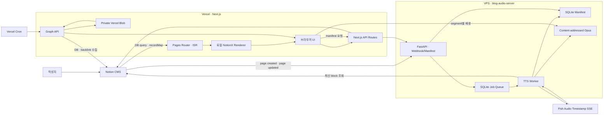
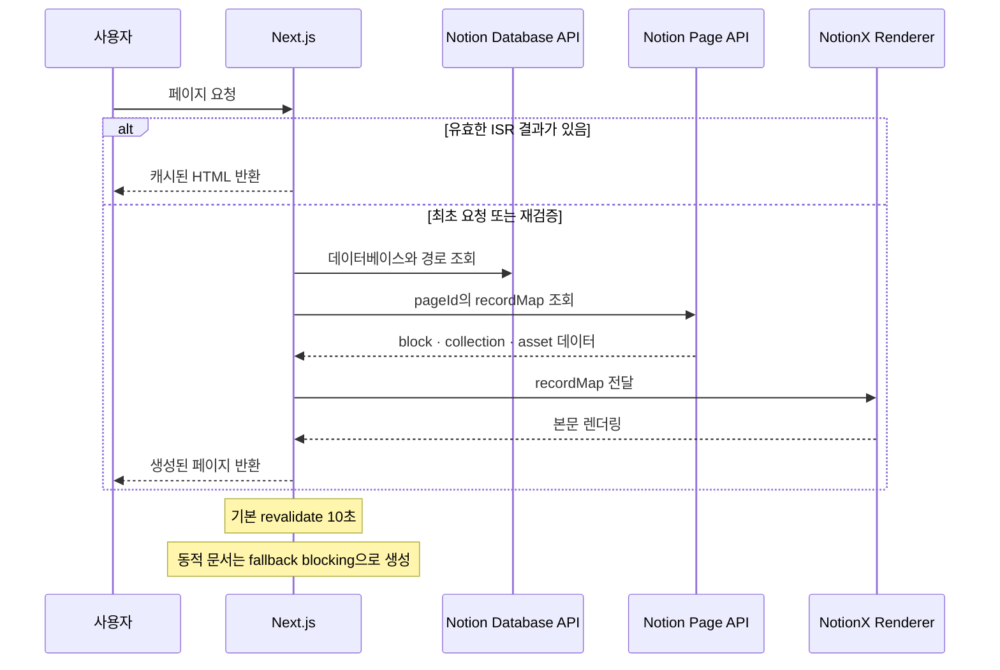
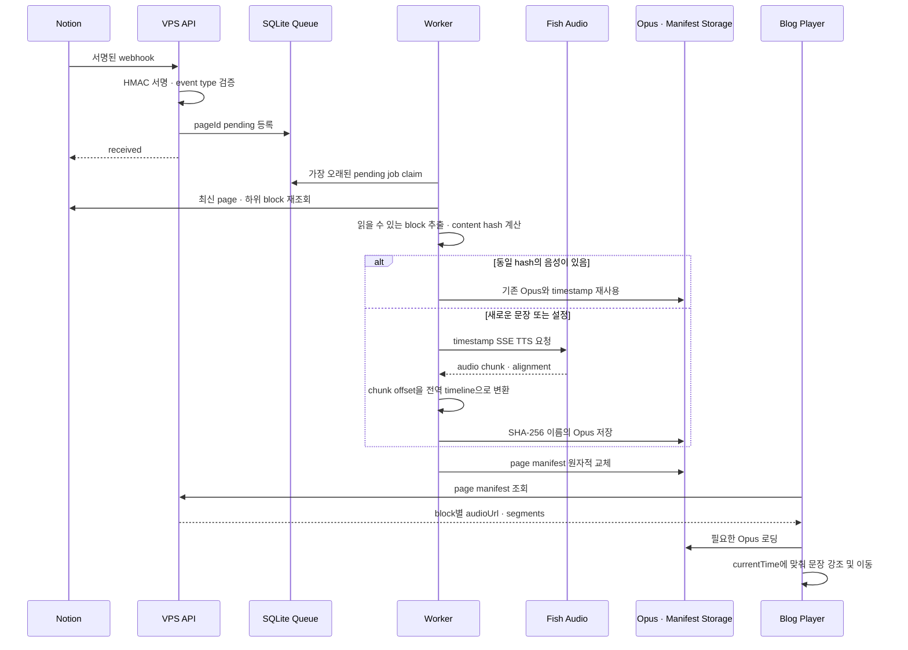
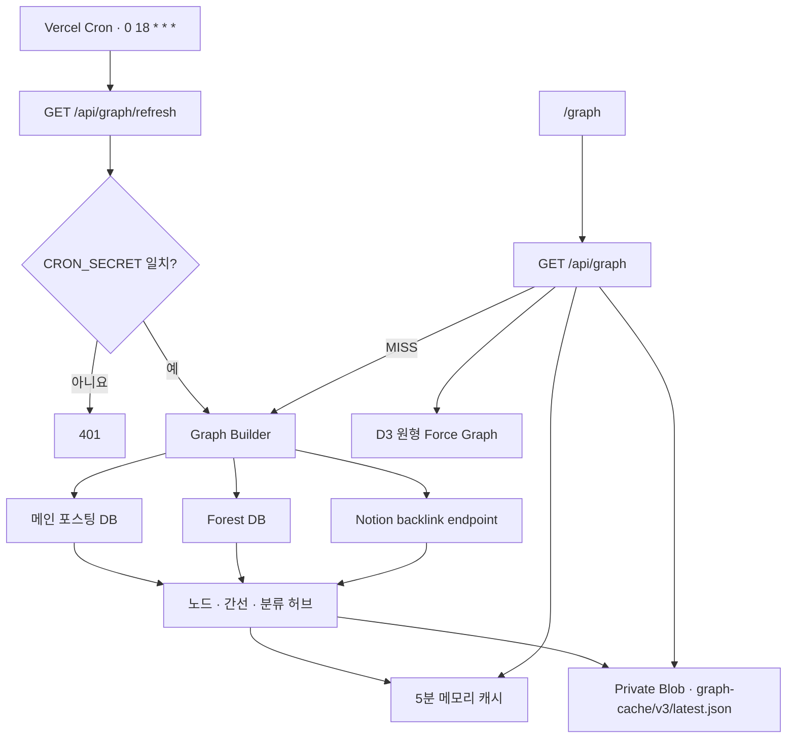

Notion을 CMS로 사용하는 개인 블로그입니다. Next.js Pages Router와 ISR로 게시물·문서·월말결산을 제공하고, NotionX 렌더러로 본문을 표시합니다. 별도의 VPS 음성 서버는 Notion webhook을 받아 Fish Audio 기반 TTS를 생성하며, 백링크 데이터는 D3 그래프로 시각화합니다.

## 주요 기능

- Notion 데이터베이스를 원본으로 사용하는 게시물 목록과 상세 페이지
- `fallback: "blocking"`과 10초 ISR을 이용한 신규 문서 자동 노출
- 저장소에 포함된 NotionX 기반 본문, 코드, 수식, 컬렉션 렌더링
- 포스팅·문서·프로젝트·월말결산을 연결하는 Obsidian 스타일 백링크 그래프
- 문서 탐색에 최적화된 `/forest` 2패널 리더와 모바일 전환 UI
- 월말결산 전용 `/recap` 뷰어
- Notion webhook과 VPS worker를 이용한 비동기 TTS 생성
- 문장 타임스탬프 기반 재생, 강조, 이전/다음 문장 이동
- 본문 해시 기반 AI 요약 생성 및 Notion 속성 캐시
- Notion Comments API 기반 댓글
- Vercel OG 기반 소셜 공유 이미지
- 다크 모드와 반응형 레이아웃

## 전체 아키텍처



## 핵심 작동 방식

### 1. Notion 본문과 ISR



- `/`는 메인 Notion 데이터베이스를 조회해 포스팅 카드를 생성합니다.
- `/[pageId]`는 메인 DB와 forest DB의 문서를 정적 경로로 만들고, 새 문서는 blocking fallback으로 처리합니다.
- 상세 본문은 `notion-client`의 recordMap을 로컬 `packages/notionx` 렌더러에 전달합니다.
- `/forest`와 `/recap`은 `forest_분류` select 값으로 문서 종류를 분리합니다.
- Notion 요청 실패 시 목록 페이지는 빈 데이터와 더 긴 재검증 주기로 폴백합니다.

### 2. TTS 생성과 재생



TTS 서버는 API와 worker가 같은 Docker image와 `/data` 볼륨을 공유합니다.

- webhook은 `page.created`, `page.content_updated`, `page.properties_updated`만 큐에 넣습니다.
- webhook payload의 본문을 그대로 음성화하지 않고 worker가 항상 최신 Notion block을 다시 조회합니다.
- `POST /v1/pages/:pageId/sync`의 `202 Accepted`는 큐 등록 성공을 뜻하며 생성 완료를 뜻하지 않습니다.
- 정규화된 텍스트, 음성 reference, 모델, 속도, narrator version으로 content hash를 만듭니다.
- 같은 hash는 문서나 block이 달라도 하나의 Opus asset을 공유합니다.
- 문서 전체 처리가 성공한 경우에만 manifest를 교체하며, 실패하면 이전 manifest를 유지합니다.
- 더 이상 참조되지 않는 Opus asset은 정리합니다.

### 3. 백링크 그래프와 캐시



- 메인 DB의 페이지는 `포스팅`으로 분류합니다.
- forest DB는 `forest_분류` 값에 따라 `프로젝트`, `월말결산(일지)`, `문서`로 분류합니다.
- `/api/graph`는 메모리 → private Blob → 즉시 재생성 순서로 데이터를 찾습니다.
- 같은 런타임에서 동시에 발생한 cache miss는 하나의 graph build Promise를 공유합니다.
- Blob이 없어도 동작하지만 cold start 뒤에는 전체 그래프를 다시 생성하므로 응답이 느릴 수 있습니다.

### 4. AI 요약과 댓글

- 게시물 본문 텍스트의 MD5와 Notion의 `ai_summary` rich text 속성에 저장된 hash를 비교합니다.
- hash가 바뀐 경우에만 OpenAI로 한국어 요약을 생성하고 `[hash] summary` 형식으로 Notion에 저장합니다.
- 댓글 조회와 작성은 `/api/comments/[id]`가 Notion Comments API를 서버 측에서 호출합니다.
- Notion API key와 OpenAI API key는 브라우저 번들에 포함하지 않습니다.

## 기술 스택

| 영역 | 기술 |
| --- | --- |
| 웹 프레임워크 | Next.js 16 Pages Router, React 19, TypeScript/JavaScript |
| 렌더링 | ISR, blocking fallback, 로컬 NotionX |
| CMS/API | Notion REST API, Notion page recordMap API |
| UI | Tailwind CSS, CSS, Framer Motion, Ionicons |
| 그래프 | D3 force simulation, Vercel Blob, Vercel Cron |
| 음성 | FastAPI, SQLite, Fish Audio timestamp SSE, Opus |
| 배포 | Vercel, Docker Compose 기반 VPS |
| 부가 기능 | OpenAI 요약, Vercel OG, KaTeX, PrismJS |

## 페이지와 API

### 사용자 페이지

| 경로 | 역할 | 데이터 방식 |
| --- | --- | --- |
| `/` | 포스팅 목록 | Notion DB + ISR |
| `/[pageId]` | 포스팅/문서 상세 | recordMap + ISR + blocking fallback |
| `/forest` | 문서 목록과 리더 | 목록 ISR + 선택 문서 API 로딩 |
| `/recap` | 월말결산 뷰어 | forest DB의 `일지` 분류 + ISR |
| `/graph` | 전체 백링크 그래프 | graph API + D3 |
| `/embed/[pageId]` | 임베드용 문서 | recordMap + ISR |
| `/sitemap.xml` | 동적 사이트맵 | 서버 렌더링 |

### 주요 Next.js API

| 경로 | 메서드 | 역할 |
| --- | --- | --- |
| `/api/forest/[pageId]` | GET | forest 문서 recordMap 조회 |
| `/api/recap/[pageId]` | GET | 월말결산 recordMap과 narration manifest 결합 |
| `/api/narration/[pageId]` | GET | VPS narration manifest 프록시 |
| `/api/backlink` | POST | 특정 pageId의 백링크 조회 |
| `/api/graph` | GET | 캐시된 전체 그래프 반환 |
| `/api/graph/refresh` | GET | 인증된 그래프 snapshot 재생성 |
| `/api/comments/[id]` | GET, POST | Notion 댓글 조회/작성 |
| `/api/search-notion` | POST | Notion 검색 |
| `/api/social-image` | GET | 1200×630 OG 이미지 생성 |

### VPS TTS API

| 경로 | 메서드 | 역할 |
| --- | --- | --- |
| `/health` | GET | 상태 확인 |
| `/webhooks/notion` | POST | Notion webhook 수신과 서명 검증 |
| `/v1/pages/[pageId]/sync` | POST | 관리자 토큰으로 수동 queue 등록 |
| `/v1/pages/[pageId]/manifest` | GET | 문서별 음성 manifest 조회 |
| `/audio/[sha256].opus` | GET | immutable Opus asset 제공 |

## 프로젝트 구조

```text
notion-blog/
├─ components/                 # 공통 UI, Forest, Recap, Graph, TTS player
├─ hooks/                      # 테마, 게시물 metadata, 읽기 시간
├─ packages/notionx/           # 프로젝트에 맞게 포함한 Notion 본문 renderer
├─ pages/
│  ├─ api/                     # Notion, narration, graph, comment API routes
│  ├─ forest/                  # 문서 탐색 화면
│  ├─ graph/                   # 전체 백링크 그래프
│  ├─ recap/                   # 월말결산 화면
│  ├─ [pageId].js              # 게시물/문서 상세 ISR
│  └─ index.js                 # 포스팅 목록 ISR
├─ styles/                     # 전역, Notion, Forest, Recap, Graph 스타일
├─ utils/                      # Notion query, graph build/cache, AI summary
├─ public/                     # 폰트와 정적 asset
├─ blog-audio-server/
│  ├─ app/                     # FastAPI, queue, worker, TTS, alignment
│  ├─ tests/                   # 음성 서버 테스트
│  ├─ docker-compose.yml       # API/worker와 공유 volume
│  └─ sync_all_pages.py        # 기존 모든 문서 수동 queue 등록
└─ vercel.json                 # graph refresh cron
```

## 로컬 실행

### 요구사항

- Next.js 16을 실행할 수 있는 Node.js
- Yarn 1.x
- Notion integration과 대상 데이터베이스 접근 권한
- TTS 서버까지 실행하려면 Docker 및 Docker Compose

### 웹 애플리케이션

```bash
git clone https://github.com/IceCream0910/blog.git
cd blog
yarn install
yarn dev
```

기본 개발 주소는 `http://localhost:3000`입니다.

프로덕션 빌드와 실행:

```bash
yarn build
yarn start
```

### 음성 서버

```bash
cd blog-audio-server
cp .env.example .env
docker compose pull
docker compose up -d
curl http://127.0.0.1:8787/health
```

Windows PowerShell에서는 `cp` 대신 다음 명령을 사용할 수 있습니다.

```powershell
Copy-Item .env.example .env
```

## 환경변수

### Next.js

루트에 `.env.local`을 만들거나 Vercel Project Settings에 등록합니다.

```dotenv
# Notion 공식 API: DB query, 댓글, OG, AI summary cache
NOTION_API_KEY=

# Notion 내부 backlink endpoint용 token_v2 cookie
NOTION_TOKEN=

# 게시물 AI 요약 생성
OPENAI_API_KEY=

# 배포 origin. OG font와 image URL 생성에 사용
NEXT_PUBLIC_URL=http://localhost:3000

# VPS narration API origin
AUDIO_SERVER_URL=https://audio.example.com

# Private Vercel Blob
BLOB_READ_WRITE_TOKEN=
BLOB_STORE_ID=

# /api/graph/refresh 보호 및 Vercel Cron 인증
CRON_SECRET=
```

| 변수 | 필수 범위 | 설명 |
| --- | --- | --- |
| `NOTION_API_KEY` | 기본 기능 | 데이터베이스, 댓글, 속성 갱신, OG API 접근 |
| `NOTION_TOKEN` | 백링크/그래프 | 서버 전용 Notion `token_v2`; 외부 노출 금지 |
| `OPENAI_API_KEY` | AI 요약 | 요약 생성 미사용 시 생략 가능 |
| `NEXT_PUBLIC_URL` | 배포 권장 | OG 이미지와 font의 절대 URL 기준 |
| `AUDIO_SERVER_URL` | TTS | VPS API origin; 미설정 시 narration API는 503 |
| `BLOB_READ_WRITE_TOKEN` | 그래프 캐시 | private graph snapshot 읽기/쓰기 |
| `BLOB_STORE_ID` | Vercel Blob | 연결된 Blob store 식별 정보 |
| `CRON_SECRET` | 그래프 갱신 | refresh API의 Bearer 인증 값 |

### VPS 음성 서버

`blog-audio-server/.env.example`을 복사해 사용합니다.

| 변수 | 설명 |
| --- | --- |
| `FISH_API_KEY` | Fish Audio API 인증 |
| `FISH_REFERENCE_ID` | 사용할 voice reference |
| `FISH_MODEL` | TTS 모델 |
| `NOTION_API_KEY` | page와 block 재조회 |
| `NOTION_WEBHOOK_TOKEN` | Notion webhook HMAC 검증 |
| `NOTION_DATABASE_IDS` | 허용할 DB ID 목록, 쉼표 구분 |
| `PUBLIC_BASE_URL` | manifest의 `audioUrl`에 사용할 외부 HTTPS origin |
| `ADMIN_TOKEN` | 수동 sync API Bearer token |
| `DATA_DIR` | SQLite와 Opus 저장 경로, 기본 `/data` |
| `NARRATOR_VERSION` | 음성 cache key를 수동 무효화하는 version |
| `TTS_SPEED` | 합성 속도 |
| `CORS_ORIGINS` | Opus 접근을 허용할 blog origin 목록 |

## Notion 구성

### 데이터베이스

애플리케이션은 두 개의 Notion 데이터베이스를 사용합니다.

1. 메인 DB: 일반 포스팅
2. Forest DB: `문서`, `프로젝트`, `일지` 분류

현재 DB ID는 `pages/index.js`, `pages/[pageId].js`, `pages/forest/index.js`, `pages/recap/index.js`, `utils/build-graph-data.ts`에 상수로 정의되어 있습니다. 다른 workspace로 이전할 때 이 경로들을 함께 변경해야 합니다.

Forest DB에서 코드가 직접 참조하는 주요 속성:

| 속성 | 타입/용도 |
| --- | --- |
| `이름` | title |
| `forest_분류` | select: `문서`, `프로젝트`, `일지` |
| `forest_날짜` | 월말결산 정렬/월 판정 |
| `music`, `watching`, `reading` | 월말결산용 JSON rich text |

일반 포스팅의 카테고리·태그·작성일은 recordMap 내부 property ID도 참조합니다. Notion 속성을 새로 만들거나 복제하면 ID가 바뀔 수 있으므로 `hooks/usePostMetadata.js`와 게시물 판정 로직을 함께 확인해야 합니다.

### Integration 권한

- 두 데이터베이스와 하위 페이지를 integration에 공유합니다.
- 댓글 작성을 사용하려면 comment 생성 권한이 필요합니다.
- AI 요약을 Notion에 캐시하려면 page property 갱신 권한이 필요합니다.
- VPS integration에도 `NOTION_DATABASE_IDS`에 지정한 모든 데이터베이스 접근 권한을 부여합니다.

## TTS 서버 운영

### Webhook 연결

1. VPS의 `https://audio.example.com`을 `127.0.0.1:8787`로 reverse proxy합니다.
2. `PUBLIC_BASE_URL`을 같은 HTTPS origin으로 설정합니다.
3. Notion webhook endpoint를 `https://audio.example.com/webhooks/notion`으로 지정합니다.
4. 최초 verification payload의 token을 `NOTION_WEBHOOK_TOKEN`에 저장하고 subscription을 확인합니다.
5. `page.created`, `page.content_updated`, `page.properties_updated` 이벤트를 구독합니다.

### 수동 동기화

한 문서:

```bash
curl -X POST \
  -H "Authorization: Bearer $ADMIN_TOKEN" \
  https://audio.example.com/v1/pages/PAGE_ID/sync
```

전체 문서:

```bash
cd blog-audio-server
python -m venv .venv
source .venv/bin/activate
pip install -r requirements.txt
python sync_all_pages.py
```

Windows PowerShell에서는 virtual environment를 다음과 같이 활성화합니다.

```powershell
python -m venv .venv
.\.venv\Scripts\Activate.ps1
pip install -r requirements.txt
python sync_all_pages.py
```

전체 동기화 스크립트는 두 데이터베이스를 페이지네이션하고 pageId를 중복 제거한 뒤 sync API에 등록합니다. 반환된 `202` 개수와 실제 생성 완료 개수는 다를 수 있으므로 worker와 manifest를 추가로 확인합니다.

### 상태 확인

```bash
docker compose ps
docker compose logs -f api
docker compose logs -f worker
curl https://audio.example.com/health
curl https://audio.example.com/v1/pages/PAGE_ID/manifest
```

테스트용 Docker image:

```bash
cd blog-audio-server
docker build --target test -t blog-audio-server:test .
```

## 그래프 캐시 운영

1. Vercel 프로젝트에 private Blob store를 연결합니다.
2. `BLOB_READ_WRITE_TOKEN`과 충분히 긴 `CRON_SECRET`을 등록합니다.
3. 배포 후 최초 snapshot을 인증된 refresh 요청으로 생성합니다.

```bash
curl \
  -H "Authorization: Bearer $CRON_SECRET" \
  https://blog.example.com/api/graph/refresh
```

`vercel.json`은 매일 `0 18 * * *`에 refresh endpoint를 호출합니다. 정상 응답에는 생성 시각과 node/link 수가 포함됩니다.

확인할 응답 헤더:

```text
X-Graph-Cache: HIT   # memory 또는 Blob snapshot 사용
X-Graph-Cache: MISS  # 요청 중 새 snapshot 생성
```

## 배포

### Vercel

1. GitHub 저장소를 Vercel 프로젝트에 연결합니다.
2. Next.js 환경변수를 Production, Preview, Development 범위에 맞게 등록합니다.
3. private Blob store와 Cron 설정을 확인합니다.
4. `yarn build`가 성공하는지 확인하고 배포합니다.
5. `/`, `/forest`, `/recap`, `/graph`, 임의의 `/[pageId]`를 확인합니다.

### VPS

1. Docker와 reverse proxy를 준비합니다.
2. `blog-audio-server/.env`를 서버에서만 관리합니다.
3. API와 worker가 같은 Docker volume을 사용하도록 실행합니다.
4. `/health`, worker log, manifest, Opus Range 요청을 확인합니다.
5. 이미지나 환경변수를 변경했다면 API와 worker를 모두 재생성합니다.